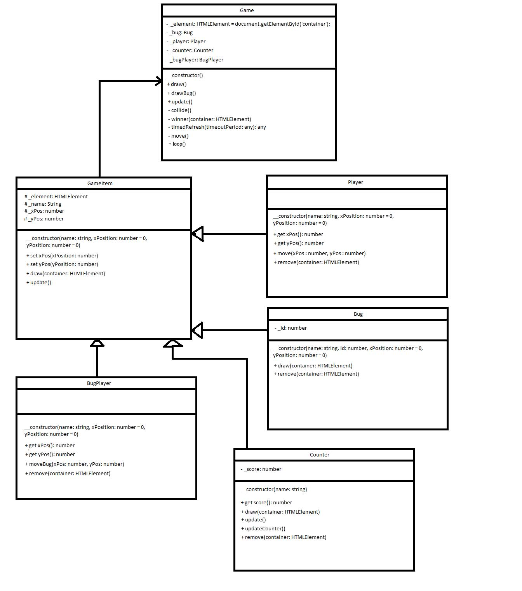

# BugSlayer
A Typescript keyboard party game.
Gemaakt op 2-1-2018

Scenario

Welkom bij Daan vs Bug!
Bij dit spel is het de bedoeling dat je zo snel mogelijk als bugslayer bugs oppakt, voordat de bug dit kan doen!
Dit spel werkt op 1 keyboard dus twee spelers keunnen tegen elkaar strijden om bugs op te pakken.
Controlls: Speler 1: A: Left W: Up S: Down D: Right
Speler 2: H: Left U: Up J: Down K: Right
De gene die als eerst 20 bugs pakt heeft gewonnen! Het spel zal dan een win scherm geven en vervolgens opnieuw opstarten voor een volgende ronde!

Klassendiagram

Live hosting via Bitbucket
foxyla.bitbucket.io

